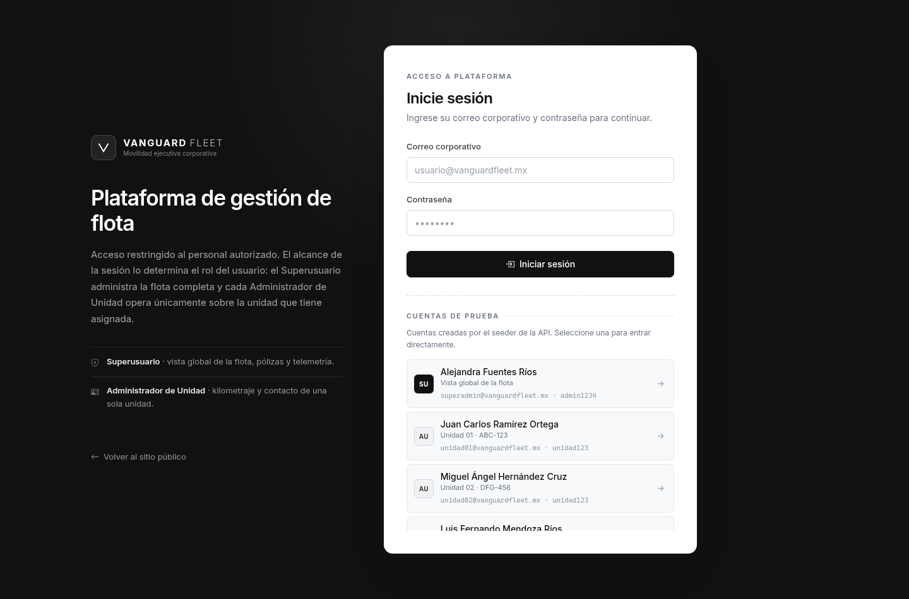
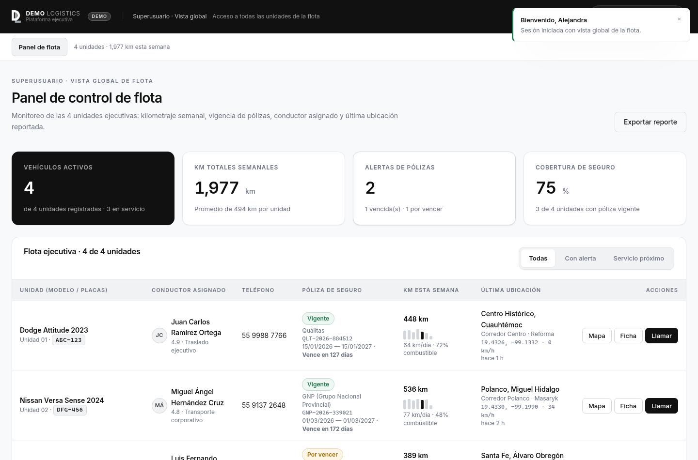
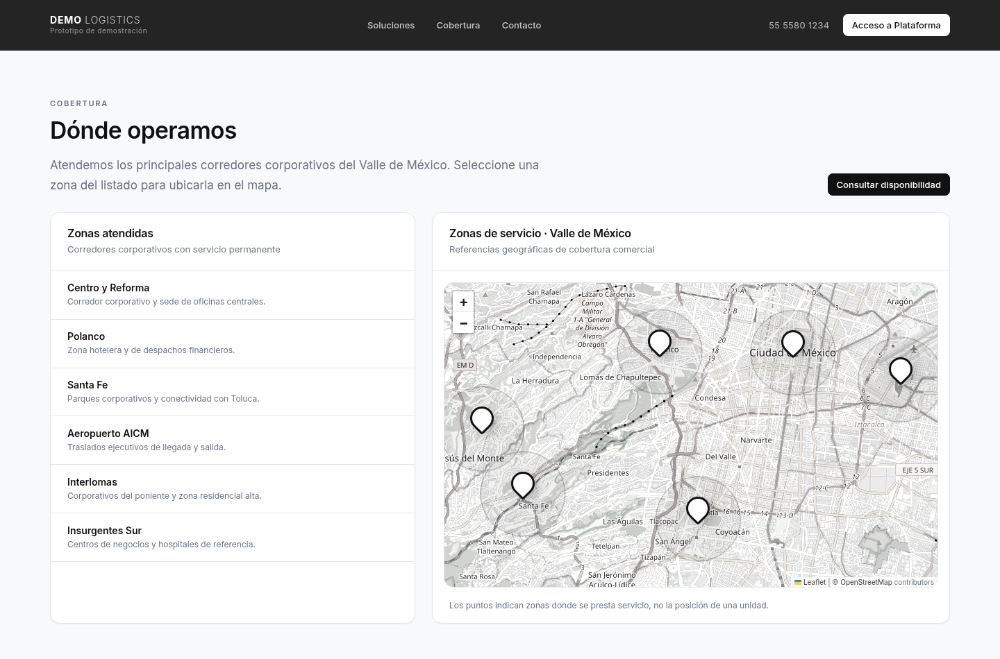
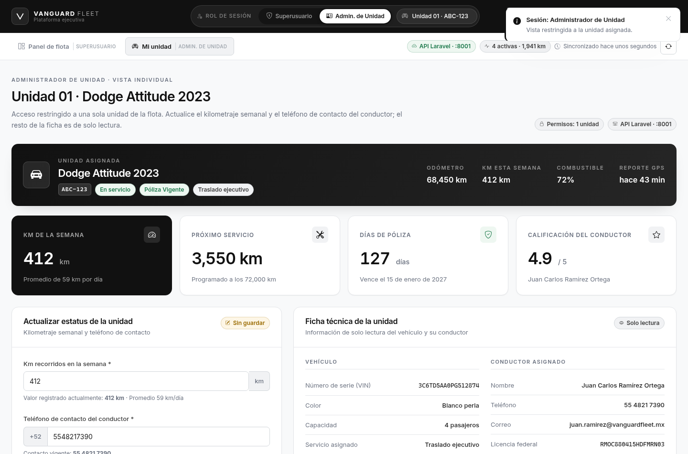
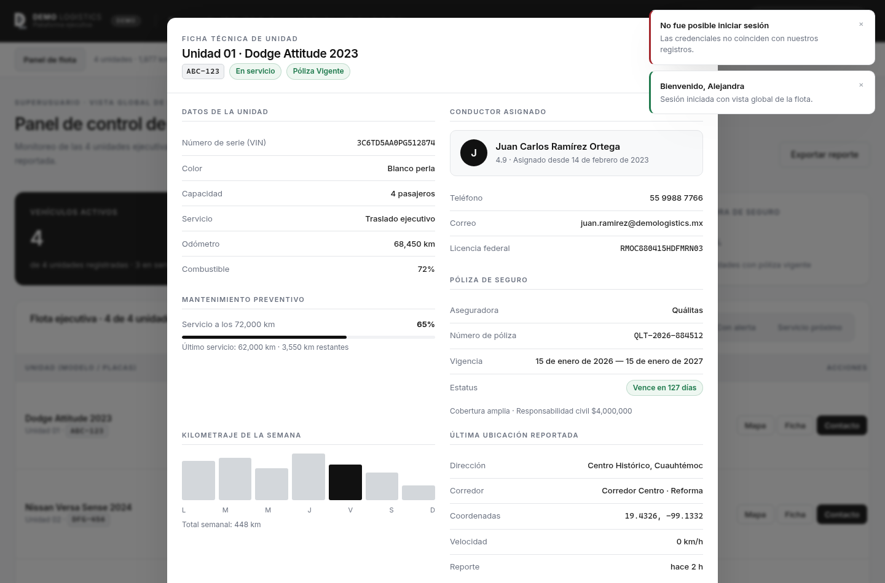
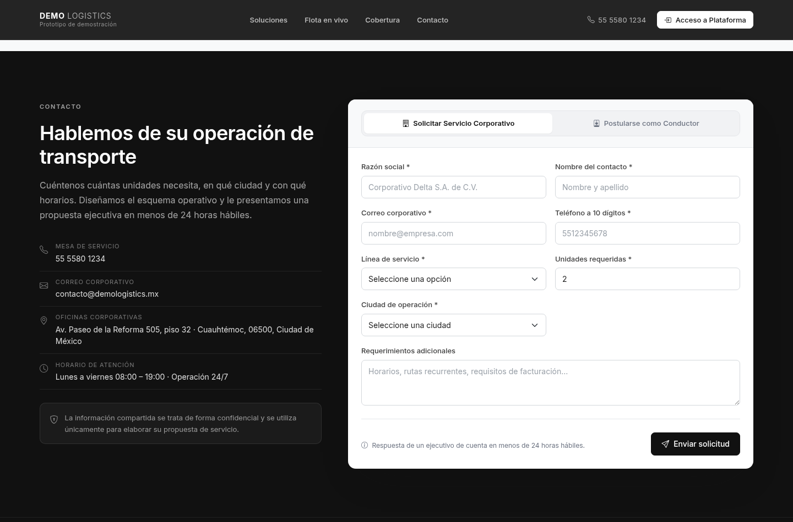

> **Prototipo de demostración.** *DemoLogistics* no es una empresa real: es el nombre de
> trabajo de este ejercicio técnico. Todas las unidades, conductores, pólizas, correos y
> credenciales son ficticios y se generan con seeders.

# DemoLogistics · Plataforma ejecutiva de gestión de flota

Aplicación de **movilidad ejecutiva y transporte corporativo privado**: administración de
unidades, conductores verificados, control de pólizas de seguro, kilometraje y telemetría GPS.

No simula una arrendadora de autos: se presenta como un **operador de flota corporativa**, con
una estética sobria en negro, gris oscuro, blanco y acentos mínimos sobre gris claro
(`#111`, `#1e1e1e`, `#f8f9fa`).

| | |
|---|---|
| **Frontend** | Angular 22 (standalone + zoneless + Signals) · Bootstrap 5 · Leaflet · SCSS · puerto **4201** |
| **Backend** | Laravel 13 · API REST JSON · Sanctum · MySQL/MariaDB · puerto **8001** |
| **Datos** | Todo servido por el backend: 4 unidades ejecutivas y 5 cuentas de acceso creadas por seeders |

---

## 1. Autenticación y control de acceso

El acceso a la plataforma se realiza con **credenciales reales** validadas contra la base de
datos. La API emite un token de Laravel Sanctum que el frontend adjunta como `Bearer` en cada
petición; el rol y la unidad asignada **nunca** se deciden en el cliente.

### Cuentas del seeder

| Rol | Correo | Contraseña | Alcance |
|---|---|---|---|
| Superusuario | `superadmin@demologistics.mx` | `admin1234` | Vista global de la flota (4 unidades) |
| Administrador de Unidad 01 | `unidad01@demologistics.mx` | `unidad123` | Sólo Unidad 01 · ABC-123 |
| Administrador de Unidad 02 | `unidad02@demologistics.mx` | `unidad123` | Sólo Unidad 02 · DFG-456 |
| Administrador de Unidad 03 | `unidad03@demologistics.mx` | `unidad123` | Sólo Unidad 03 · HIJ-789 |
| Administrador de Unidad 04 | `unidad04@demologistics.mx` | `unidad123` | Sólo Unidad 04 · KLM-012 |

Las cuentas se declaran **una sola vez** en `backend/config/demologistics.php`; de ahí las toma el
`UserSeeder` para crearlas y `LandingController` para mostrarlas como atajos en la pantalla de
acceso. Ese endpoint sólo responde con `APP_DEBUG=true`, así que en un entorno real la lista
llega vacía y la pantalla no muestra credenciales.

### Matriz de autorización

Aplicada en el backend con `VehiclePolicy` y *route model binding*:

| Recurso | Superusuario | Administrador de Unidad |
|---|---|---|
| `GET /api/vehicles` | 4 unidades | **sólo la suya** |
| `GET /api/vehicles/{id}` | cualquiera | la suya · **403** en las demás |
| `PATCH /api/vehicles/{id}/telemetry` | cualquiera | la suya · **403** en las demás |
| `GET /api/fleet/summary` | 200 | **403** |
| `GET /api/leads` | 200 | **403** |

En el frontend, `authGuard` exige sesión, `roleGuard` mantiene la URL alineada con el rol y el
interceptor HTTP cierra la sesión y devuelve al acceso ante un `401`. No existe ningún selector
de roles: el alcance se deriva del token.

---

## 2. Arquitectura

```
DemoLogistics/
├── frontend/                                       Angular 22 · :4201
│   └── src/
│       ├── environments/environment.ts             URL de la API, intervalos de refresco
│       ├── styles.scss                             Sistema de diseño (paleta corporativa)
│       └── app/
│           ├── app.config.ts                       Router + HttpClient + interceptor
│           ├── app.routes.ts                       / · /acceso · /plataforma/{flota,unidad}
│           ├── core/
│           │   ├── models/fleet.models.ts          Modelo de dominio
│           │   ├── interceptors/auth.interceptor.ts  Bearer token · Accept JSON · 401
│           │   ├── guards/auth.guard.ts            authGuard · guestGuard
│           │   ├── guards/role.guard.ts            Coherencia ruta ↔ rol
│           │   ├── services/
│           │   │   ├── auth.service.ts             Sesión, rol y permisos (Signals)
│           │   │   ├── auth-api.service.ts         /auth/login · me · logout
│           │   │   ├── token-storage.service.ts    Persistencia del token
│           │   │   ├── fleet.service.ts            Estado de flota + refresco automático
│           │   │   ├── fleet-api.service.ts        /vehicles · /fleet/summary · /leads
│           │   │   ├── landing.service.ts          Contenido público
│           │   │   ├── landing-api.service.ts      /public/overview · demo-accounts
│           │   │   ├── clock.service.ts            Reloj de 1 s para los "hace X"
│           │   │   ├── api-mappers.ts              Traducción snake_case → camelCase
│           │   │   └── toast.service.ts            Notificaciones
│           │   └── utils/                          Formateadores · marcadores · rutas por rol
│           ├── shared/components/                  toast-host · stat-card · fleet-map · ficha técnica
│           └── features/
│               ├── auth/login-page/                Pantalla de credenciales
│               ├── landing/                        Header · Hero · Soluciones · Cobertura · Captación · Footer
│               └── platform/
│                   ├── platform-shell/             Barra de sesión y navegación por rol
│                   ├── superuser-dashboard/        Vista global de flota
│                   └── unit-admin-dashboard/       Vista de la unidad asignada
└── backend/                                        Laravel 13 · :8001
    ├── routes/api.php                              Endpoints públicos y protegidos
    ├── config/demologistics.php                         Contenido comercial + cuentas demo
    ├── app/Models/                                 Vehicle · User · CorporateLead · DriverApplication
    ├── app/Policies/VehiclePolicy.php              Reglas de acceso por rol
    ├── app/Http/Controllers/Api/                   Auth · Vehicle · Landing · Lead
    ├── app/Http/Requests/                          Validación de entrada
    ├── app/Http/Resources/                         VehicleResource · PublicVehicleResource · UserResource
    ├── database/migrations/                        6 migraciones
    ├── database/seeders/                           VehicleSeeder · UserSeeder
    └── database/factories/                         Factories para pruebas
```

### Estado

`FleetService` es la única fuente de verdad del panel. Expone Signals de sólo lectura y:

- Carga la flota y —sólo para el Superusuario— las métricas globales.
- **Refresca la telemetría en segundo plano** cada 30 s (`environment.telemetryRefreshMs`)
  y permite forzarlo con el botón *Actualizar*. El refresco es silencioso: no se muestran
  indicadores de estado.
- Aplica las actualizaciones de unidad de forma **optimista** y las revierte si la API las
  rechaza, informando al usuario.

---

## 3. Puesta en marcha

### Requisitos

- Node.js 20+ y npm
- PHP 8.3+ y Composer
- MySQL o MariaDB en `127.0.0.1:3306`

### Backend (puerto 8001)

```bash
cd backend
composer install
cp .env.example .env && php artisan key:generate

mysql -u root -p -e "CREATE DATABASE demologistics CHARACTER SET utf8mb4 COLLATE utf8mb4_unicode_ci;"
# Ajustar credenciales en .env (DB_DATABASE=demologistics, DB_USERNAME, DB_PASSWORD)

php artisan migrate:fresh --seed
php artisan serve --host=127.0.0.1 --port=8001
```

### Frontend (puerto 4201)

```bash
cd frontend
npm install
npx ng serve --port 4201 --host 127.0.0.1
```

| Servicio | URL |
|---|---|
| Landing pública | http://localhost:4201/ |
| Acceso a la plataforma | http://localhost:4201/acceso |
| Panel de flota (Superusuario) | http://localhost:4201/plataforma/flota |
| Mi unidad (Administrador de Unidad) | http://localhost:4201/plataforma/unidad |
| API Laravel | http://127.0.0.1:8001/api/health |

---

## 4. Vistas

### 4.1 Landing pública (`/`)

- **Header minimalista** con logotipo, navegación por anclas y botón **Acceso a Plataforma**
  que lleva a la pantalla de credenciales.
- **Hero** con la propuesta de valor y el **logotipo** (`public/images/logo-claro.png`). No hay
  panel con datos: la landing no publica información de la aplicación.
- **Pilares institucionales**: cobertura, disponibilidad, conductores y unidades.
- **Soluciones** y **canales de contacto**: contenido servido por el backend.
- **Cobertura:** mapa Leaflet con las **zonas comerciales** donde se presta servicio, no la
  posición de las unidades, más el listado de corredores atendidos.
- **Animaciones de entrada** al hacer scroll, con el mismo criterio que los sitios Wix
  (IntersectionObserver + transiciones CSS), escalonadas por tarjeta y desactivadas cuando el
  sistema pide movimiento reducido.

> **La landing no expone datos operativos.** `/api/public/overview` devuelve únicamente
> contenido institucional (marca, contacto, soluciones, catálogos, pilares y zonas de
> cobertura). No incluye unidades, matrículas, kilometrajes, pólizas, posiciones ni datos de
> los conductores; hay pruebas que lo verifican.
- **Formulario de captación** con dos pestañas —*Solicitar Servicio Corporativo* y *Postularse
  como Conductor*— cuyas ciudades y líneas de servicio también llegan de la API. Al enviar
  registran la solicitud en el backend y devuelven el folio (`DL-COR-…` / `DL-CON-…`).

### 4.2 Acceso (`/acceso`)

Pantalla de credenciales con validación contra la base de datos. Incluye atajos a las cuentas
del seeder (sólo con `APP_DEBUG`), mensaje de error legible para credenciales inválidas y aviso
cuando la sesión expira.

Tanto el logotipo como la barra superior de la plataforma muestran un distintivo **Demo** para
dejar claro que se trata de un prototipo con datos simulados.

### 4.3 Panel de flota · Superusuario (`/plataforma/flota`)

- **Métricas clave** en tarjetas ejecutivas: vehículos activos (4), km totales semanales
  (1,941 km), alertas de pólizas (2) y cobertura de seguro (75 %).
- **Tabla general de flota** con las columnas: Unidad (Modelo/Placas), Conductor asignado,
  Teléfono, Póliza de seguro (estatus y vigencia), Km registrados esta semana, Última ubicación
  y Acciones. Con filtros rápidos, exportación a CSV y ficha técnica en modal.
- **Mapa interactivo** con las 4 unidades sobre el Valle de México, coloreadas por estatus de
  póliza.
- **Panel de alertas de pólizas** y distribución de kilometraje por unidad.

### 4.4 Mi unidad · Administrador de Unidad (`/plataforma/unidad`)

Vista restringida a la unidad asignada en la base de datos (`users.vehicle_id`), sin selector
de unidades ni acceso a ninguna otra:

- **Formulario rápido** de kilometraje semanal y teléfono de contacto, con validación en cliente
  y servidor.
- **Ficha técnica** de sólo lectura: VIN, color, capacidad, odómetro, mantenimiento preventivo,
  conductor y licencia federal.
- **Estatus de la póliza** con vigencia, días restantes y aviso de renovación.
- **Mapa individual** con la última ubicación y halo de geocerca.

---

## 5. Datos de prueba

Creados por `VehicleSeeder` y `UserSeeder`: conductores mexicanos, teléfonos ficticios a 10
dígitos, pólizas con vigencia real y coordenadas coherentes del Valle de México.

| Unidad | Modelo | Placas | Conductor | Teléfono | Póliza | Vigencia | Km/semana | Ubicación |
|---|---|---|---|---|---|---|---|---|
| Unidad 01 | Dodge Attitude 2023 | ABC-123 | Juan Carlos Ramírez Ortega | 55 4821 7390 | Quálitas `QLT-2026-884512` | 15/01/2026 – 15/01/2027 · **Vigente** | 412 km | Centro Histórico · `19.4326, -99.1332` |
| Unidad 02 | Nissan Versa Sense 2024 | DFG-456 | Miguel Ángel Hernández Cruz | 55 9137 2648 | GNP `GNP-2026-339021` | 01/03/2026 – 01/03/2027 · **Vigente** | 536 km | Polanco · `19.4330, -99.1990` |
| Unidad 03 | Volkswagen Virtus Highline 2024 | HIJ-789 | Luis Fernando Mendoza Ríos | 81 2045 8891 | AXA `AXA-2025-117854` | 25/10/2025 – 25/10/2026 · **Por vencer** | 389 km | Santa Fe · `19.3667, -99.2667` |
| Unidad 04 | Toyota Avanza LE 2023 | KLM-012 | Ricardo Alejandro Domínguez Peña | 33 6712 4405 | HDI `HDI-2025-556210` | 16/08/2025 – 16/08/2026 · **Vencida** | 604 km | AICM Terminal 2 · `19.4200, -99.0800` |

El estatus de cada póliza **se deriva de su vigencia** (umbral de aviso: 60 días), por lo que la
demo permanece coherente sin importar cuándo se ejecute.

Estos datos **sólo se ven dentro de la plataforma**, nunca en la landing pública.

---

## 6. API REST (puerto 8001)

### Públicos

| Método | Endpoint | Descripción |
|---|---|---|
| `GET` | `/api/health` | Estado del servicio |
| `GET` | `/api/public/overview` | Soluciones, catálogos, contacto, indicadores y flota publicada |
| `GET` | `/api/public/demo-accounts` | Cuentas de prueba (vacío salvo con `APP_DEBUG`) |
| `POST` | `/api/leads/corporate` | Alta de solicitud de servicio corporativo |
| `POST` | `/api/leads/drivers` | Alta de postulación de conductor |

### Autenticación

| Método | Endpoint | Descripción |
|---|---|---|
| `POST` | `/api/auth/login` | Credenciales → token Bearer (limitado a 20 intentos/min) |
| `GET` | `/api/auth/me` | Perfil, rol, unidad asignada y permisos |
| `POST` | `/api/auth/logout` | Revoca el token |

### Protegidos (requieren `Authorization: Bearer <token>`)

| Método | Endpoint | Descripción |
|---|---|---|
| `GET` | `/api/vehicles` | Unidades visibles según el rol |
| `GET` | `/api/vehicles/{id}` | Detalle (403 si no corresponde) |
| `PATCH` | `/api/vehicles/{id}/telemetry` | `weekly_km` y/o `driver_phone` |
| `GET` | `/api/fleet/summary` | Métricas globales (sólo Superusuario) |
| `GET` | `/api/leads` | Bandeja de solicitudes (sólo Superusuario) |

Todas las respuestas usan el sobre `{ "data": …, "message"?: … }`, con validación por Form
Requests (422) y errores de autenticación en JSON (401). CORS habilitado para
`http://localhost:4201`.

```bash
TOKEN=$(curl -s -X POST http://127.0.0.1:8001/api/auth/login \
  -H 'Content-Type: application/json' \
  -d '{"email":"unidad01@demologistics.mx","password":"unidad123"}' | jq -r .data.token)

curl -s http://127.0.0.1:8001/api/vehicles -H "Authorization: Bearer $TOKEN" | jq '.data | length'   # 1
curl -s -o /dev/null -w '%{http_code}\n' http://127.0.0.1:8001/api/vehicles/unit-02 -H "Authorization: Bearer $TOKEN"  # 403
```

---

## 7. Pruebas

```bash
cd backend  && php artisan test --compact      # 32 pruebas · 203 aserciones
cd frontend && npx ng test --watch=false       # 4 pruebas del guard de rol
cd frontend && npx ng build                    # compilación de producción
```

- `AuthApiTest` — emisión y revocación de tokens, credenciales inválidas, validación, `401` JSON.
- `FleetApiTest` — alcance por rol: el Superusuario ve 4 unidades y el Administrador de Unidad
  sólo la suya, con `403` al intentar consultar o modificar otra.
- `LandingApiTest` — contenido público e indicadores derivados de la flota real, verificando que
  **no** se expongan datos personales del conductor.
- `role.guard.spec.ts` — regresión del ciclo infinito de redirección.

Además se ejecutó una **verificación visual automatizada** del flujo completo (navegador
headless): landing pública, acceso con credenciales válidas e inválidas, sesión de Superusuario,
sesión de dos Administradores de Unidad distintos, intento de escalada de privilegios por URL,
actualización de telemetría, ausencia de indicadores de estado e iconografía, y vista móvil —
**30 comprobaciones, 0 errores de página**.

---

## 8. Decisiones técnicas

- **Interfaz sin ruido:** no hay indicadores de estado («en vivo», «en línea», «operando»,
  «sincronizado») ni iconografía decorativa. La información se presenta como texto y datos;
  el refresco de telemetría ocurre en segundo plano. Los pines del mapa son formas de color,
  sin glifos.
- **Animaciones accesibles:** la directiva `dlReveal` usa un `IntersectionObserver` y un
  *signal* (la app es zoneless, una propiedad normal no dispararía la detección de cambios).
  Con `prefers-reduced-motion` el contenido aparece de inmediato.

- **Zoneless + Signals:** todo el estado vive en Signals, así que la detección de cambios se
  dispara sólo cuando algo cambia realmente. El reloj de 1 s alimenta los textos relativos sin
  provocar recargas de datos.
- **El backend es la única autoridad:** el rol, la unidad asignada y los permisos llegan en
  `/api/auth/me`; el cliente no puede elegirlos ni ampliarlos. `VehiclePolicy` corta cualquier
  acceso indebido aunque se manipule la URL.
- **Sin datos hardcodeados:** la flota, el contenido comercial, los catálogos del formulario y
  las cuentas de prueba se sirven desde la API. Editar `config/demologistics.php` no requiere
  recompilar Angular.
- **Privacidad en la landing:** `PublicVehicleResource` publica sólo datos operativos y el
  nombre de pila del conductor.
- **Mapa tolerante a fallos:** teselas de OpenStreetMap (sin API key) desaturadas por CSS para
  respetar la paleta corporativa; si no cargan, el componente degrada a una rejilla local
  manteniendo pines, popups y geocercas.
- **Guard de rol sin ciclos:** `roleGuard` redirige a la vista del rol *activo*, nunca a la ruta
  solicitada, con prueba de regresión.
- **Formularios que no se pisan:** el formulario del Administrador de Unidad sólo se sincroniza
  con la telemetría cuando está intacto, para que el refresco automático no borre lo que el
  usuario escribe.

---

## 9. Identidad gráfica

El logotipo vive en `frontend/public/images/` en dos variantes, más los iconos del navegador:

| Archivo | Uso |
|---|---|
| `images/logo.png` | Variante original (negro y gris) para superficies claras |
| `images/logo-claro.png` | Variante clara para superficies oscuras (hero, cabeceras) |
| `images/icono-512.png` | Icono de 512 px |
| `favicon-32.png` | Icono de la pestaña del navegador |
| `apple-touch-icon.png` | Icono para iOS (180 px) |

Los archivos se generan a partir del logotipo original recortando el espacio transparente
sobrante y produciendo la variante clara por remapeo de tonos, de modo que el monograma se lea
tanto sobre negro como sobre blanco.

---

## 10. Capturas

| Acceso a la plataforma | Panel de flota (Superusuario) |
|---|---|
|  |  |

| Mapa de operación | Mi unidad (Administrador de Unidad) |
|---|---|
|  |  |

| Ficha técnica | Captación de clientes |
|---|---|
|  |  |

---

## 11. Notas

**DemoLogistics es un nombre de trabajo, no una marca.** El proyecto es un prototipo de
demostración: los nombres, teléfonos, pólizas, VIN y matrículas son ficticios, y las
coordenadas corresponden a ubicaciones públicas de la Ciudad de México usadas como referencia
geográfica. Las contraseñas del seeder son deliberadamente simples y la lista de cuentas sólo
se publica con `APP_DEBUG` activo.
