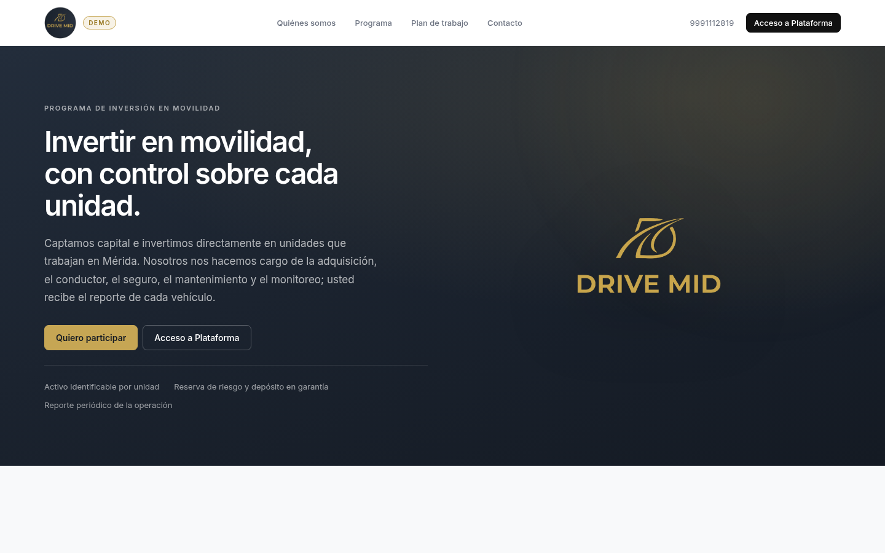
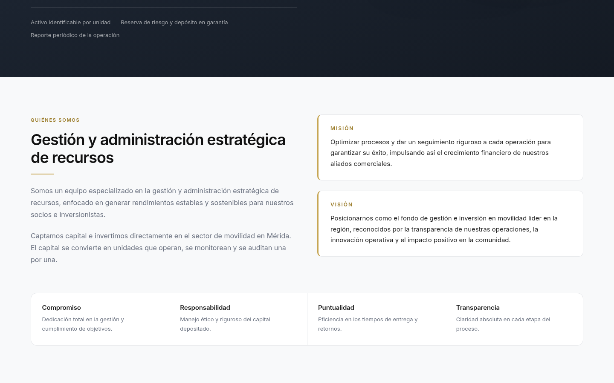
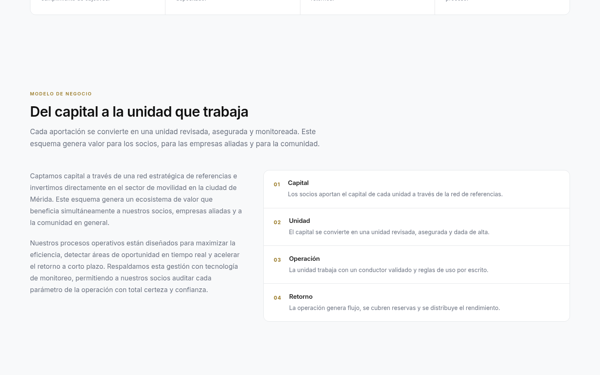
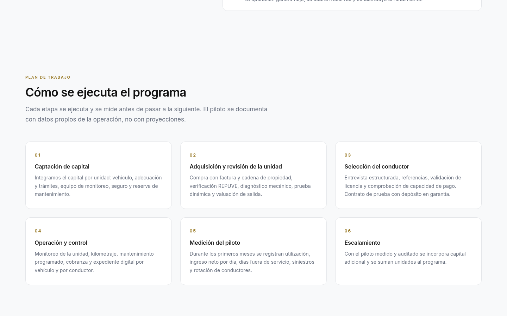
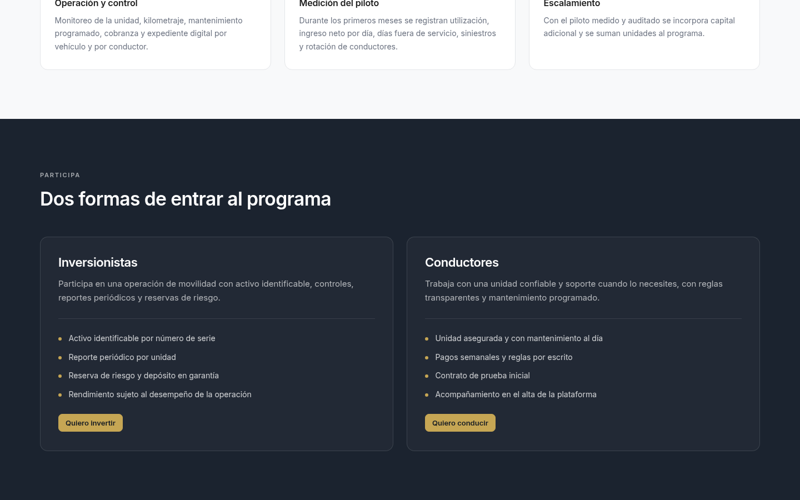
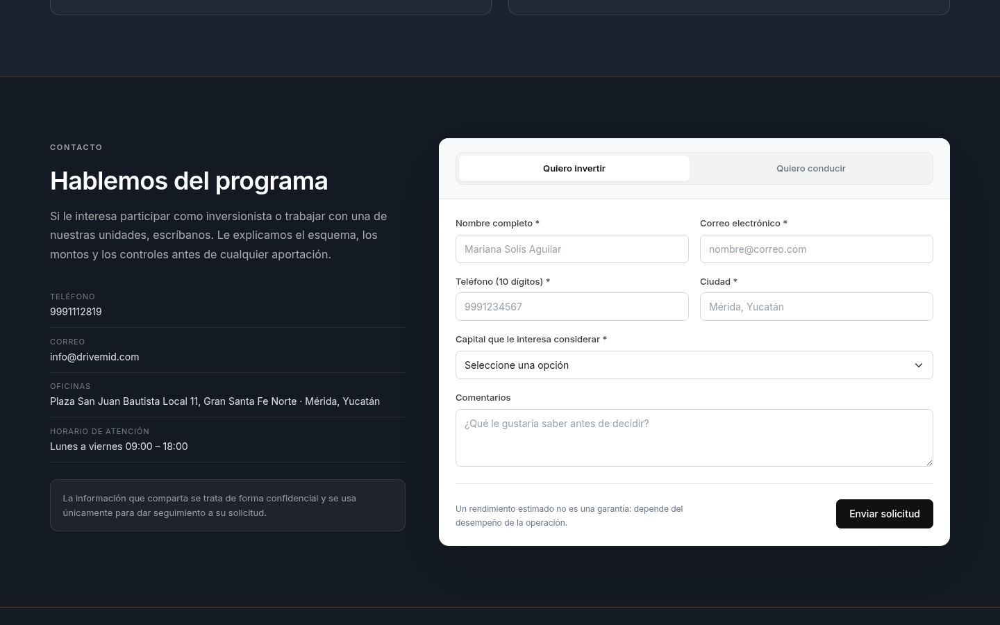
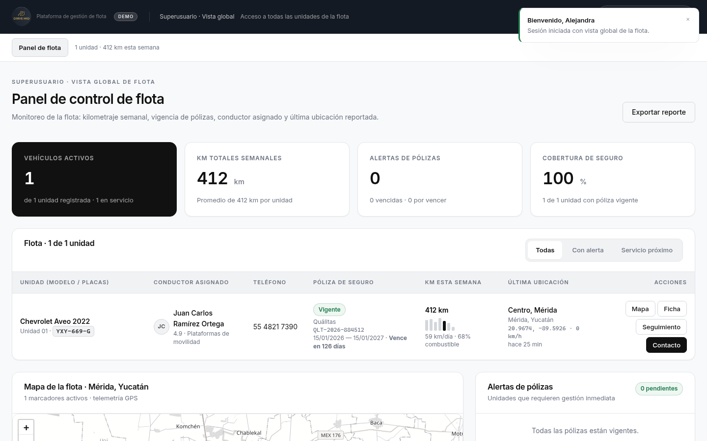
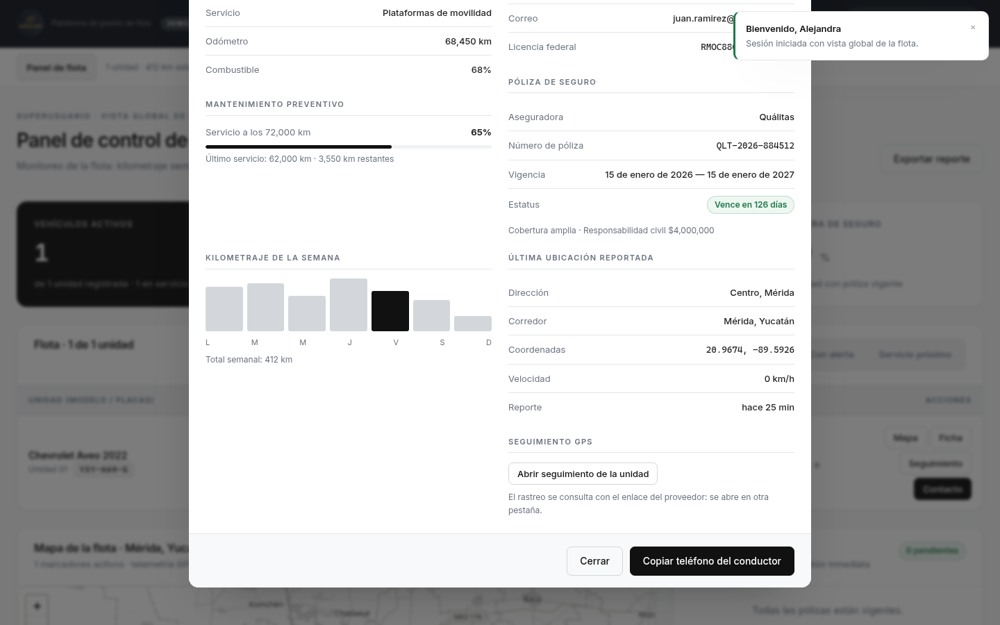
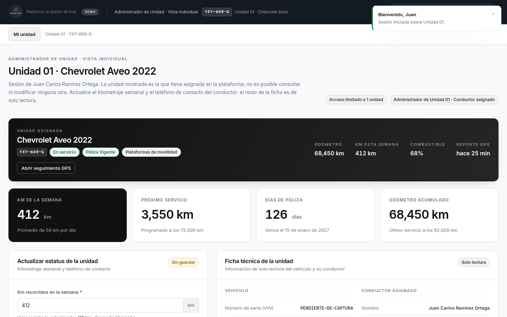

> **Prototipo de demostración.** El repositorio se llama *DemoLogistics*: es el nombre del
> ejercicio técnico, no una empresa. El contenido, la marca y el logotipo son del cliente —
> **Drive Mid**, un programa de inversión en movilidad en Mérida, Yucatán—. Los datos
> operativos que muestra la plataforma son de ejemplo y se generan con seeders.

# DemoLogistics · Plataforma de gestión de flota

Aplicación para un **programa de inversión en movilidad**: el sitio público presenta el programa
(quiénes somos, misión, visión, valores, modelo de negocio, plan de trabajo y sus dos públicos,
inversionistas y conductores) y la plataforma administra las unidades en las que ese capital se
convierte: kilometraje, mantenimiento preventivo, pólizas de seguro y seguimiento.

No es la landing de un transportista corporativo ni de una arrendadora, y no tiene secciones de
cobertura ni de ciudades: es el sitio de un programa de inversión. La estética es sobria sobre
gris claro (`#111`, `#1e1e1e`, `#f8f9fa`) con los colores de la marca del cliente —azul marino y
dorado— tomados de su logotipo.

| | |
|---|---|
| **Frontend** | Angular 22 (standalone + zoneless + Signals) · Bootstrap 5 · Leaflet · SCSS · puerto **4201** |
| **Backend** | Laravel 13 · API REST JSON · Sanctum · MySQL/MariaDB · puerto **8001** |
| **Datos** | Todo servido por el backend: **1 unidad** del cliente y **2 cuentas** de acceso creadas por seeders |

---

## 1. Autenticación y control de acceso

El acceso a la plataforma se realiza con **credenciales reales** validadas contra la base de
datos. La API emite un token de Laravel Sanctum que el frontend adjunta como `Bearer` en cada
petición; el rol y la unidad asignada **nunca** se deciden en el cliente.

### Cuentas del seeder

| Rol | Correo | Contraseña | Alcance |
|---|---|---|---|
| Superusuario | `superadmin@drivemid.com` | `admin1234` | Vista global de la flota |
| Administrador de Unidad 01 | `unidad01@drivemid.com` | `unidad123` | Sólo Unidad 01 · YXY-669-G |

Las cuentas se declaran **una sola vez** en `backend/config/drivemid.php`; de ahí las toma el
`UserSeeder` para crearlas y `LandingController` para mostrarlas como atajos en la pantalla de
acceso. Ese endpoint sólo responde con `APP_DEBUG=true`, así que en un entorno real la lista
llega vacía y la pantalla no muestra credenciales.

### Matriz de autorización

Aplicada en el backend con `VehiclePolicy` y *route model binding*:

| Recurso | Superusuario | Administrador de Unidad |
|---|---|---|
| `GET /api/vehicles` | toda la flota | **sólo la suya** |
| `GET /api/vehicles/{id}` | cualquiera | la suya · **403** en las demás |
| `PATCH /api/vehicles/{id}/telemetry` | cualquiera | la suya · **403** en las demás |
| `GET /api/fleet/summary` | 200 | **403** |
| `GET /api/leads` | 200 | **403** |

En el frontend, `authGuard` exige sesión, `roleGuard` mantiene la URL alineada con el rol y el
interceptor HTTP cierra la sesión y devuelve al acceso ante un `401`. No existe ningún selector
de roles: el alcance se deriva del token.

---

## 2. Arquitectura

```
DemoLogistics/
├── frontend/                                       Angular 22 · :4201
│   └── src/
│       ├── environments/environment.ts             URL de la API, intervalos de refresco
│       ├── styles.scss                             Sistema de diseño (paleta neutra + marca)
│       └── app/
│           ├── app.config.ts                       Router + HttpClient + interceptor
│           ├── app.routes.ts                       / · /acceso · /plataforma/{flota,unidad}
│           ├── core/
│           │   ├── models/fleet.models.ts          Modelo de dominio
│           │   ├── interceptors/auth.interceptor.ts  Bearer token · Accept JSON · 401
│           │   ├── guards/auth.guard.ts            authGuard · guestGuard
│           │   ├── guards/role.guard.ts            Coherencia ruta ↔ rol
│           │   ├── services/
│           │   │   ├── auth.service.ts             Sesión, rol y permisos (Signals)
│           │   │   ├── auth-api.service.ts         /auth/login · me · logout
│           │   │   ├── token-storage.service.ts    Persistencia del token
│           │   │   ├── fleet.service.ts            Estado de flota + refresco automático
│           │   │   ├── fleet-api.service.ts        /vehicles · /fleet/summary · /leads
│           │   │   ├── landing.service.ts          Contenido del sitio público
│           │   │   ├── landing-api.service.ts      /public/overview · demo-accounts
│           │   │   ├── clipboard.service.ts        Copiado de teléfono y correo
│           │   │   ├── api-mappers.ts              Traducción snake_case → camelCase
│           │   │   └── toast.service.ts            Notificaciones
│           │   └── utils/                          Formateadores · marcadores · rutas por rol
│           ├── shared/components/                  toast-host · stat-card · fleet-map · ficha técnica · contacto
│           └── features/
│               ├── auth/login-page/                Pantalla de credenciales
│               ├── landing/                        Header · Hero · Quiénes somos · Modelo · Plan · Públicos · Captación · Footer
│               └── platform/
│                   ├── platform-shell/             Barra de sesión y navegación por rol
│                   ├── superuser-dashboard/        Vista global de flota
│                   └── unit-admin-dashboard/       Vista de la unidad asignada
└── backend/                                        Laravel 13 · :8001
    ├── routes/api.php                              Endpoints públicos y protegidos
    ├── config/drivemid.php                         Identidad, contenido del sitio y cuentas demo
    ├── app/Models/                                 Vehicle · User · InvestorLead · DriverApplication
    ├── app/Policies/VehiclePolicy.php              Reglas de acceso por rol
    ├── app/Http/Controllers/Api/                   Auth · Vehicle · Landing · Lead
    ├── app/Http/Requests/                          Validación de entrada
    ├── app/Http/Resources/                         VehicleResource · UserResource
    ├── database/migrations/                        8 migraciones
    ├── database/seeders/                           VehicleSeeder · UserSeeder
    └── database/factories/                         Factories para pruebas
```

### Estado

`FleetService` es la única fuente de verdad del panel. Expone Signals de sólo lectura y:

- Carga la flota y —sólo para el Superusuario— las métricas globales.
- **Refresca la telemetría en segundo plano** cada 30 s (`environment.telemetryRefreshMs`). El
  refresco es silencioso: no se muestran indicadores de estado, y no hay botón de refresco manual.
- Aplica las actualizaciones de unidad de forma **optimista** y las revierte si la API las
  rechaza, informando al usuario.

---

## 3. Puesta en marcha

### Requisitos

- Node.js 20+ y npm
- PHP 8.3+ y Composer
- MySQL o MariaDB en `127.0.0.1:3306`

### Backend (puerto 8001)

```bash
cd backend
composer install
cp .env.example .env && php artisan key:generate

mysql -u root -p -e "CREATE DATABASE demologistics CHARACTER SET utf8mb4 COLLATE utf8mb4_unicode_ci;"
# Ajustar credenciales en .env (DB_DATABASE=demologistics, DB_USERNAME, DB_PASSWORD)

php artisan migrate:fresh --seed
php artisan serve --host=127.0.0.1 --port=8001
```

### Frontend (puerto 4201)

```bash
cd frontend
npm install
npx ng serve --port 4201 --host 127.0.0.1
```

| Servicio | URL |
|---|---|
| Sitio público | http://localhost:4201/ |
| Acceso a la plataforma | http://localhost:4201/acceso |
| Panel de flota (Superusuario) | http://localhost:4201/plataforma/flota |
| Mi unidad (Administrador de Unidad) | http://localhost:4201/plataforma/unidad |
| API Laravel | http://127.0.0.1:8001/api/health |

---

## 4. Vistas

### 4.1 Sitio público (`/`)

Sitio del programa de inversión, en secciones ancladas. Todo el texto proviene de
`config/drivemid.php` a través de `/api/public/overview`:

- **Header** con el logotipo, navegación por anclas (*Quiénes somos · Programa · Plan de trabajo ·
  Contacto*), el teléfono institucional y el botón **Acceso a Plataforma**. El distintivo **Demo**
  deja claro que es un prototipo.
- **Portada** (`#inicio`) — «Invertir en movilidad, con control sobre cada unidad», con el
  logotipo dorado y dos llamadas a la acción: *Quiero participar* y *Acceso a Plataforma*.
- **Quiénes somos** (`#nosotros`) — presentación de la firma, **misión**, **visión** y los cuatro
  valores del programa.
- **Modelo de negocio** (`#programa`) — cómo el capital se convierte en operación, en cuatro
  pasos: capital, unidad, operación y retorno.
- **Plan de trabajo** (`#plan`) — las seis etapas de ejecución, de la captación de capital al
  escalamiento.
- **A quién se dirige** (`#participa`) — dos tarjetas, **inversionistas** y **conductores**, cada
  una con sus condiciones y su llamada a la acción.
- **Captación y contacto** (`#contacto`) — el formulario con dos pestañas y los canales
  institucionales.
- **Footer** con el programa, los accesos y los datos de contacto.

El sitio **no tiene secciones de cobertura ni de ciudades**, y **no publica datos operativos**:
`/api/public/overview` devuelve únicamente contenido institucional (marca, contacto, quiénes
somos, misión, visión, valores, modelo de negocio, plan de trabajo, públicos y el catálogo de
capitales). No incluye unidades, matrículas, kilometrajes, pólizas, posiciones ni datos de los
conductores; hay pruebas que lo verifican.

- **Formulario de captación** con dos pestañas —*Quiero invertir* y *Quiero conducir*— sobre el
  mismo componente. El catálogo de rangos de capital llega de la API; al enviar, la solicitud se
  registra en el backend y la pantalla devuelve el folio de seguimiento.
- **Datos de contacto mediante copiado**: no hay enlaces `tel:` ni `mailto:` en ninguna parte de
  la aplicación. Esos esquemas hacen que el navegador muestre su propio aviso de "abrir
  aplicación externa", que no se puede estilizar ni suprimir; en su lugar el dato se copia al
  portapapeles con confirmación visual.
- **Animaciones de entrada** al hacer scroll (IntersectionObserver + transiciones CSS),
  escalonadas por tarjeta y desactivadas cuando el sistema pide movimiento reducido.

### 4.2 Acceso (`/acceso`)

Pantalla de credenciales con validación contra la base de datos. Incluye atajos a las cuentas
del seeder (sólo con `APP_DEBUG`), mensaje de error legible para credenciales inválidas y aviso
cuando la sesión expira.

Tanto el logotipo como la barra superior de la plataforma muestran un distintivo **Demo** para
dejar claro que se trata de un prototipo con datos simulados.

### 4.3 Panel de flota · Superusuario (`/plataforma/flota`)

- **Métricas clave** en tarjetas ejecutivas: vehículos activos, km totales semanales, alertas de
  pólizas y cobertura de seguro. Se calculan en el backend a partir de la flota real.
- **Tabla general de flota** con las columnas: Unidad (Modelo / Placas), Conductor asignado,
  Teléfono, Póliza de seguro, Km esta semana, Última ubicación y Acciones. Con filtros rápidos,
  exportación a CSV y ficha técnica en modal.
- **Acciones por unidad**: *Mapa* (la ubica en el mapa), *Ficha* (abre la ficha técnica),
  *Seguimiento* (abre el enlace GPS del proveedor, sólo si la unidad lo tiene registrado) y
  *Contacto* (modal con los datos del conductor listos para copiar).
- **Mapa interactivo** de la flota centrado en Mérida, Yucatán, con los pines coloreados por
  estatus de póliza.
- **Panel de alertas de pólizas** y distribución de kilometraje por unidad.

### 4.4 Mi unidad · Administrador de Unidad (`/plataforma/unidad`)

Vista restringida a la unidad asignada en la base de datos (`users.vehicle_id`), sin selector de
unidades ni acceso a ninguna otra:

- **Encabezado** con el aviso «Acceso limitado a 1 unidad» y el puesto del usuario.
- **Identificación de la unidad** con placas, estatus, estatus de póliza y tipo de servicio, más
  el botón **Abrir seguimiento GPS** cuando hay enlace registrado.
- **Formulario rápido** de kilometraje semanal y teléfono de contacto, con validación en cliente
  y servidor.
- **Ficha técnica** de sólo lectura: VIN, color, capacidad, odómetro, mantenimiento preventivo,
  conductor y licencia federal.
- **Ficha de contacto** en un modal del propio sistema, con el teléfono y el correo del conductor
  listos para copiar sin salir de la plataforma.
- **Estatus de la póliza** con vigencia, días restantes y aviso de renovación.
- **Mapa individual** con la última ubicación y halo de geocerca.

---

## 5. Datos de la unidad

El seeder carga **una sola unidad**, que corresponde al vehículo real del cliente.

| Campo | Valor | Origen |
|---|---|---|
| Unidad | Unidad 01 | — |
| Marca / Modelo / Año | Chevrolet Aveo 2022 | **Cliente** |
| Placas | YXY-669-G | **Cliente** |
| Color | Gris | **Cliente** |
| Capacidad | 5 pasajeros | **Cliente** |
| Estatus | `en_servicio` | **Cliente** |
| Tipo de servicio | Plataformas de movilidad | — |
| VIN | `PENDIENTE-DE-CAPTURA` | **Falta capturar** |
| Odómetro, km de la semana y mantenimiento | 68 450 km · 412 km · servicios a 62 000 / 72 000 km | Ejemplo |
| Conductor | Juan Carlos Ramírez Ortega · 5548217390 · `juan.ramirez@drivemid.com` | Ejemplo |
| Póliza | Quálitas `QLT-2026-884512` · 15/01/2026 – 15/01/2027 · cobertura amplia | Ejemplo |
| Última ubicación | Centro, Mérida · `20.9674, -89.5926` | Ejemplo |

Es decir: **la identidad del vehículo es real**, pero el **VIN, el odómetro, la póliza y el
conductor siguen siendo datos de ejemplo pendientes de captura**. El estatus de la póliza y los
días restantes **se derivan de su vigencia** (umbral de aviso: 60 días), por lo que la demo
permanece coherente sin importar cuándo se ejecute.

Estos datos **sólo se ven dentro de la plataforma**, nunca en el sitio público.

### 5.1 Seguimiento GPS

El cliente rastrea sus unidades **por Bluetooth y consulta la posición con un link por unidad**,
no con una API. Por eso:

- La tabla `vehicles` tiene la columna **`tracking_url`** (nullable).
- `VehicleResource` la expone como `tracking_url` y el frontend la mapea a `trackingUrl`.
- La interfaz ofrece tres accesos directos: el botón **Seguimiento** en la tabla del panel de
  flota, el bloque **Seguimiento GPS** en la ficha técnica y **Abrir seguimiento GPS** en la
  vista de unidad.

El enlace real de rastreo **no se versiona**, porque da acceso a la ubicación del vehículo: el
seeder usa el marcador `https://seguimiento.ejemplo.mx/u/YXY669G`. El enlace definitivo se carga
por unidad al capturar los datos.

Un enlace da acceso directo al seguimiento del proveedor, pero **no alimenta la telemetría de la
plataforma**: `location_label`, `location_zone`, `location_lat`, `location_lng`,
`location_updated_at`, `speed_kmh`, `heading` y `fuel_level` siguen siendo valores de ejemplo
mientras no exista una API o un export de posiciones del proveedor.

### 5.2 Hoja de captura

`docs/captura-datos/plantilla sistema.xlsx` es el libro que se envía al cliente para completar
esos datos. Ver `docs/captura-datos/README.md`.

---

## 6. API REST (puerto 8001)

### Públicos

| Método | Endpoint | Descripción |
|---|---|---|
| `GET` | `/api/health` | Estado del servicio |
| `GET` | `/api/public/overview` | Contenido del sitio público |
| `GET` | `/api/public/demo-accounts` | Cuentas de prueba (vacío salvo con `APP_DEBUG`) |
| `POST` | `/api/leads/investors` | Interés en el programa de inversión (`DL-INV-…`) |
| `POST` | `/api/leads/drivers` | Postulación de conductor (`DL-CON-…`) |

### Autenticación

| Método | Endpoint | Descripción |
|---|---|---|
| `POST` | `/api/auth/login` | Credenciales → token Bearer (limitado a 20 intentos/min) |
| `GET` | `/api/auth/me` | Perfil, rol, unidad asignada y permisos |
| `POST` | `/api/auth/logout` | Revoca el token |

### Protegidos (requieren `Authorization: Bearer <token>`)

| Método | Endpoint | Descripción |
|---|---|---|
| `GET` | `/api/vehicles` | Unidades visibles según el rol |
| `GET` | `/api/vehicles/{id}` | Detalle (403 si no corresponde) |
| `PATCH` | `/api/vehicles/{id}/telemetry` | `weekly_km` y/o `driver_phone` |
| `GET` | `/api/fleet/summary` | Métricas globales (sólo Superusuario) |
| `GET` | `/api/leads` | Bandeja de prospectos (sólo Superusuario) |

Todas las respuestas usan el sobre `{ "data": …, "message"?: … }`, con validación por Form
Requests (422) y errores de autenticación en JSON (401). CORS habilitado para
`http://localhost:4201` y `http://127.0.0.1:4201`.

```bash
TOKEN=$(curl -s -X POST http://127.0.0.1:8001/api/auth/login \
  -H 'Content-Type: application/json' \
  -d '{"email":"unidad01@drivemid.com","password":"unidad123"}' | jq -r .data.token)

curl -s http://127.0.0.1:8001/api/vehicles -H "Authorization: Bearer $TOKEN" | jq '.data | length'   # 1
curl -s -o /dev/null -w '%{http_code}\n' http://127.0.0.1:8001/api/fleet/summary -H "Authorization: Bearer $TOKEN"  # 403
```

---

## 7. Pruebas

```bash
cd backend  && php artisan test --compact      # 37 pruebas · 229 aserciones
cd frontend && npx ng test --watch=false       # 4 pruebas del guard de rol
cd frontend && npx ng build                    # compilación de producción
```

De las 37 pruebas del backend, 35 cubren la API y 2 son las de ejemplo que trae Laravel
(`tests/Feature/ExampleTest.php` y `tests/Unit/ExampleTest.php`):

- `AuthApiTest` (10) — emisión y revocación de tokens, credenciales inválidas, validación,
  `401` en JSON y contraseñas almacenadas con hash.
- `FleetApiTest` (17) — alcance por rol: el Superusuario ve la flota y el Administrador de Unidad
  sólo la suya, con `403` al intentar consultar o modificar otra; captación de inversionistas y
  conductores; bandeja de prospectos reservada al Superusuario; y el enlace de seguimiento de la
  unidad.
- `LandingApiTest` (8) — contenido público, identidad del programa, modelo de negocio y plan de
  trabajo, canales de contacto reales, catálogo del formulario y verificación de que **no** se
  expongan datos operativos ni de cobertura.
- `role.guard.spec.ts` (4) — regresión del ciclo infinito de redirección.

---

## 8. Decisiones técnicas

- **Interfaz sin ruido:** no hay indicadores de estado («en vivo», «en línea», «operando»,
  «sincronizado») ni iconografía decorativa. La información se presenta como texto y datos; el
  refresco de telemetría ocurre en segundo plano. Los pines del mapa son formas de color, sin
  glifos.
- **Animaciones accesibles:** la directiva `dlReveal` usa un `IntersectionObserver` y un *signal*
  (la app es zoneless, una propiedad normal no dispararía la detección de cambios). Con
  `prefers-reduced-motion` el contenido aparece de inmediato.
- **Zoneless + Signals:** todo el estado vive en Signals, así que la detección de cambios se
  dispara sólo cuando algo cambia realmente. El contenido del sitio, la flota y las métricas son
  `computed` sobre el estado de los servicios.
- **El backend es la única autoridad:** el rol, la unidad asignada y los permisos llegan en
  `/api/auth/me`; el cliente no puede elegirlos ni ampliarlos. `VehiclePolicy` corta cualquier
  acceso indebido aunque se manipule la URL.
- **Sin datos hardcodeados:** la flota, el contenido del programa, el catálogo del formulario y
  las cuentas de prueba se sirven desde la API. Editar `config/drivemid.php` no requiere
  recompilar Angular.
- **El sitio público no revela la operación:** `/api/public/overview` sólo devuelve contenido
  institucional; no hay unidades, matrículas, kilometrajes ni datos de conductores.
- **Sin diálogos nativos:** ningún flujo depende de `alert()`, `confirm()` ni de los avisos de
  protocolo del navegador. Las confirmaciones son toasts y las acciones que muestran información
  usan los modales del sistema (`dl-unit-detail-modal`, `dl-contact-modal`).
- **Mapa tolerante a fallos:** teselas de OpenStreetMap (sin API key) desaturadas por CSS para
  respetar la paleta corporativa; si no cargan, el componente degrada a una rejilla local
  manteniendo pines, popups y geocercas.
- **Guard de rol sin ciclos:** `roleGuard` redirige a la vista del rol *activo*, nunca a la ruta
  solicitada, con prueba de regresión.
- **Formularios que no se pisan:** el formulario del Administrador de Unidad sólo se sincroniza
  con la telemetría cuando está intacto, para que el refresco automático no borre lo que el
  usuario escribe.
- **El enlace de rastreo no se versiona:** es un dato sensible (da acceso a la ubicación del
  vehículo), así que el repositorio sólo contiene un marcador de ejemplo.

---

## 9. Identidad gráfica

La paleta parte de una base neutra (`#111`, `#1e1e1e`, `#f8f9fa`) y añade los colores del cliente
tomados de su logotipo, declarados como tokens en `frontend/src/styles.scss`:

| Token | Valor | Uso |
|---|---|---|
| `--dl-navy` | `#1b232f` | Azul marino de la marca: fondos oscuros y superficies |
| `--dl-navy-deep` | `#141a23` | Variante profunda para secciones y cabeceras |
| `--dl-gold` | `#c6a654` | Dorado de la marca: acentos, botones y numeración |

El logotipo se extrajo de la maqueta que entregó el cliente (`drivemid.jpg.jpeg`) y vive en
`frontend/public/images/`, junto con los iconos del navegador:

| Archivo | Uso |
|---|---|
| `images/logo-drivemid.png` | Distintivo completo, para superficies claras |
| `images/logo-drivemid-oro.png` | Versión dorada sin círculo, para fondos oscuros (portada) |
| `images/icono-512.png` | Icono de 512 px |
| `favicon-32.png` | Icono de la pestaña del navegador |
| `apple-touch-icon.png` | Icono para iOS (180 px) |

**Pendiente:** que el cliente entregue el logotipo en vectorial (SVG, AI o EPS). Las variantes
actuales se derivan del archivo de mapa de bits de la maqueta.

---

## 10. Capturas

| Portada del sitio | Quiénes somos |
|---|---|
|  |  |

| Modelo de negocio | Plan de trabajo |
|---|---|
|  |  |

| Inversionistas y conductores | Captación y contacto |
|---|---|
|  |  |

| Acceso a la plataforma | Panel de flota (Superusuario) |
|---|---|
|  |  |

| Ficha técnica de la unidad | Mi unidad (Administrador de Unidad) |
|---|---|
|  |  |

---

## 11. Notas

**DemoLogistics es el nombre del repositorio, no una marca.** El contenido, la marca y el
logotipo son del cliente (**Drive Mid**), y el proyecto es un prototipo de demostración: salvo la
identidad del vehículo —marca, modelo, año, placas, color y capacidad, capturados por el
cliente—, los nombres, teléfonos, pólizas, VIN, kilometrajes y coordenadas son de ejemplo. Las
contraseñas del seeder son deliberadamente simples y la lista de cuentas sólo se publica con
`APP_DEBUG` activo.
