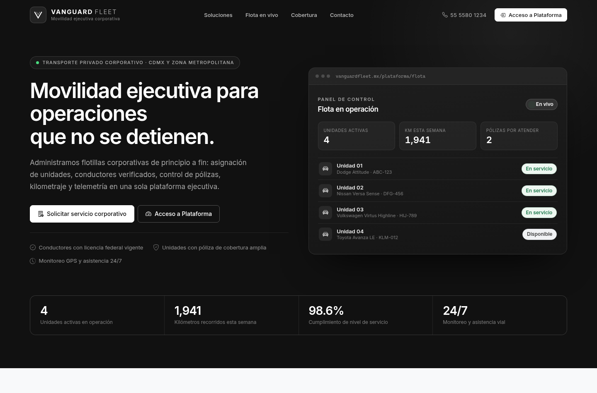

# Vanguard Fleet · Plataforma ejecutiva de gestión de flota

Demo/prototipo interactivo de una plataforma de **movilidad ejecutiva y transporte
corporativo privado**: administración de unidades, conductores verificados, control de
pólizas de seguro, kilometraje y telemetría GPS.

El proyecto no simula una arrendadora de autos: se presenta como un **operador de flota
corporativa**, con una estética sobria en negro, gris oscuro, blanco y acentos mínimos
sobre gris claro (`#111`, `#1e1e1e`, `#f8f9fa`).

| | |
|---|---|
| **Frontend** | Angular 22 (standalone + zoneless + Signals) · Bootstrap 5 · Leaflet · SCSS · puerto **4201** |
| **Backend** | Laravel 13 · API REST JSON · MySQL/MariaDB · puerto **8001** |
| **Datos** | 4 unidades ejecutivas mexicanas con mock data y seeder equivalentes |

---

## 1. Arquitectura

```
DemoLogistics/
├── frontend/                                Angular 22 · :4201
│   └── src/
│       ├── environments/environment.ts      URL base de la API
│       ├── styles.scss                      Sistema de diseño (paleta corporativa)
│       └── app/
│           ├── app.ts | app.html            Raíz: router-outlet + contenedor de toasts
│           ├── app.config.ts                provideRouter + provideHttpClient(withFetch)
│           ├── app.routes.ts                Rutas y carga diferida por vista
│           ├── core/
│           │   ├── models/fleet.models.ts   Modelo de dominio (Vehicle, Driver, Policy…)
│           │   ├── data/fleet-mock.data.ts  Dataset mock + resumen agregado
│           │   ├── services/
│           │   │   ├── fleet.service.ts         Store central con Signals
│           │   │   ├── fleet-api.service.ts     Cliente HTTP de la API Laravel
│           │   │   ├── session.service.ts       Rol simulado (Superusuario / Unidad)
│           │   │   ├── platform-nav.service.ts  Regla "una vista = un rol"
│           │   │   └── toast.service.ts         Notificaciones no bloqueantes
│           │   ├── guards/role.guard.ts     Guard funcional por rol
│           │   └── utils/                   Formateadores y fábrica de marcadores
│           ├── shared/components/           toast-host · stat-card · fleet-map · unit-detail-modal
│           └── features/
│               ├── landing/                 Header · Hero · Solutions · FleetPreview · LeadForm · Footer
│               └── platform/
│                   ├── platform-shell/      Barra superior + selector de roles
│                   ├── components/role-switcher/
│                   ├── superuser-dashboard/ Vista global de flota
│                   └── unit-admin-dashboard/Vista de una sola unidad
└── backend/                                 Laravel 13 · :8001
    ├── routes/api.php                       Endpoints REST
    ├── app/Models/                          Vehicle · CorporateLead · DriverApplication
    ├── app/Http/Controllers/Api/            VehicleController · LeadController
    ├── app/Http/Requests/                   Validación (Form Requests)
    ├── app/Http/Resources/VehicleResource   Contrato JSON snake_case
    ├── database/migrations/                 3 migraciones
    ├── database/seeders/VehicleSeeder.php   Mismo dataset que el mock del frontend
    └── database/factories/                  Factories para pruebas
```

### Estado con Signals

`FleetService` es la única fuente de verdad del frontend. Expone Signals de solo lectura y
métricas derivadas que se recalculan de forma reactiva:

```ts
readonly vehicles   = this._vehicles.asReadonly();
readonly summary    = computed(() => buildFleetSummary(this._vehicles(), this._lastSync()));
readonly rows       = computed(() => this._vehicles().map(toFleetRow));
readonly policyAlerts = computed(() => this.summary().policyAlerts);
```

**Degradación elegante:** si la API del puerto 8001 no responde (timeout de 4 s),
`FleetService.load()` cae automáticamente al dataset mock local y avisa al usuario. La demo
nunca se queda en blanco, y la barra superior indica el origen de datos activo.

---

## 2. Puesta en marcha

### Requisitos

- Node.js 20+ y npm
- PHP 8.3+ y Composer
- MySQL o MariaDB en `127.0.0.1:3306`

### Backend (puerto 8001)

```bash
cd backend
composer install
cp .env.example .env && php artisan key:generate

# Crear la base de datos
mysql -u root -p -e "CREATE DATABASE vanguard_fleet CHARACTER SET utf8mb4 COLLATE utf8mb4_unicode_ci;"

# Ajustar credenciales en .env (DB_DATABASE=vanguard_fleet, DB_USERNAME, DB_PASSWORD)
php artisan migrate:fresh --seed
php artisan serve --host=127.0.0.1 --port=8001
```

### Frontend (puerto 4201)

```bash
cd frontend
npm install
npx ng serve --port 4201 --host 127.0.0.1
```

| Servicio | URL |
|---|---|
| Landing pública | http://localhost:4201/ |
| Plataforma (Superusuario) | http://localhost:4201/plataforma/flota |
| Plataforma (Administrador de Unidad) | http://localhost:4201/plataforma/unidad |
| API Laravel | http://127.0.0.1:8001/api/health |

---

## 3. Vistas

### 3.1 Landing pública (`/`)

- **Header minimalista** con logotipo ficticio *Vanguard Fleet*, navegación por anclas y
  botón **Acceso a Plataforma**.
- **Hero** con la propuesta de valor de movilidad ejecutiva y un panel ilustrativo que
  consume la flota real del servicio.
- **Soluciones:** transporte corporativo, traslado ejecutivo, gestión integral de flota y
  grupos/eventos.
- **Flota en vivo:** mapa Leaflet con las 4 unidades, listado sincronizado y banda de
  cobertura operativa.
- **Formulario de captación** con dos pestañas:
  - *Solicitar Servicio Corporativo* — razón social, contacto, correo, teléfono a 10
    dígitos, línea de servicio, unidades y ciudad.
  - *Postularse como Conductor* — datos personales, licencia federal, experiencia y
    vehículo propio.

  Ambos validan en cliente, imprimen el payload en consola, registran la solicitud en la API
  y muestran un **toast de éxito** junto con el folio de seguimiento (`VF-COR-XXXXX` /
  `VF-CON-XXXXX`).

### 3.2 Simulación de roles

Una barra superior permite alternar la sesión sin login:

| Rol | Alcance |
|---|---|
| **Superusuario** | Vista global de la flota (4 unidades), pólizas, telemetría y métricas |
| **Administrador de Unidad** | Vista restringida a **una** unidad asignada |

El `roleGuard` mantiene la URL sincronizada con el rol activo y el selector permite
reasignar la unidad del segundo rol. La preferencia se conserva en `localStorage`.

### 3.3 Dashboard Superusuario (`/plataforma/flota`)

- **Métricas clave** en tarjetas ejecutivas: vehículos activos (4), km totales semanales
  (1,941 km), alertas de pólizas (2) y cobertura de seguro (75 %).
- **Tabla general de flota** responsiva con las columnas: Unidad (Modelo/Placas), Conductor
  asignado, Teléfono, Póliza de seguro (estatus y vigencia), Km registrados esta semana,
  Última ubicación y Acciones. Incluye filtros rápidos (*Todas · Con alerta · Servicio
  próximo*), exportación a CSV y ficha técnica en modal.
- **Mapa interactivo Leaflet** con los 4 marcadores de los vehículos activos sobre la Zona
  Metropolitana del Valle de México, coloreados por estatus de póliza y con popups de
  detalle.
- **Panel de alertas de pólizas** y distribución de kilometraje por unidad.

### 3.4 Dashboard Administrador de Unidad (`/plataforma/unidad`)

Enfocado exclusivamente en una unidad (por defecto **Unidad 01 · Dodge Attitude /
ABC-123**):

- **Formulario rápido** para ingresar los km recorridos en la semana y actualizar el
  teléfono de contacto (validación en cliente y servidor, guardado optimista y toast).
- **Ficha técnica** de solo lectura: VIN, color, capacidad, odómetro, mantenimiento
  preventivo, conductor y licencia federal.
- **Estatus de la póliza de seguro** con vigencia, días restantes y aviso de renovación.
- **Mapa individual** con la última ubicación fija del vehículo y halo de geocerca.

---

## 4. Datos mock de prueba

Cuatro unidades ejecutivas con conductores mexicanos, teléfonos ficticios a 10 dígitos,
pólizas con vigencia real y coordenadas coherentes del Valle de México.

| Unidad | Modelo | Placas | Conductor | Teléfono | Póliza | Vigencia | Km/semana | Ubicación |
|---|---|---|---|---|---|---|---|---|
| Unidad 01 | Dodge Attitude 2023 | ABC-123 | Juan Carlos Ramírez Ortega | 55 4821 7390 | Quálitas `QLT-2026-884512` | 15/01/2026 – 15/01/2027 · **Vigente** | 412 km | Centro Histórico, CDMX · `19.4326, -99.1332` |
| Unidad 02 | Nissan Versa Sense 2024 | DFG-456 | Miguel Ángel Hernández Cruz | 55 9137 2648 | GNP `GNP-2026-339021` | 01/03/2026 – 01/03/2027 · **Vigente** | 536 km | Polanco, CDMX · `19.4330, -99.1990` |
| Unidad 03 | Volkswagen Virtus Highline 2024 | HIJ-789 | Luis Fernando Mendoza Ríos | 81 2045 8891 | AXA `AXA-2025-117854` | 25/10/2025 – 25/10/2026 · **Por vencer** | 389 km | Santa Fe, CDMX · `19.3667, -99.2667` |
| Unidad 04 | Toyota Avanza LE 2023 | KLM-012 | Ricardo Alejandro Domínguez Peña | 33 6712 4405 | HDI `HDI-2025-556210` | 16/08/2025 – 16/08/2026 · **Vencida** | 604 km | AICM Terminal 2 · `19.4200, -99.0800` |

El estatus de cada póliza **se deriva de su vigencia** (umbral de aviso: 60 días), por lo que
la demo permanece coherente sin importar cuándo se ejecute.

---

## 5. API REST (puerto 8001)

| Método | Endpoint | Descripción |
|---|---|---|
| `GET` | `/api/health` | Estado del servicio, versión de Laravel y de PHP |
| `GET` | `/api/vehicles` | Listado de las unidades de la flota |
| `GET` | `/api/vehicles/{id}` | Detalle de una unidad (`unit-01` … `unit-04`) |
| `PATCH` | `/api/vehicles/{id}/telemetry` | Actualiza `weekly_km` y/o `driver_phone` |
| `GET` | `/api/fleet/summary` | Métricas agregadas calculadas en SQL |
| `POST` | `/api/leads/corporate` | Alta de solicitud de servicio corporativo |
| `POST` | `/api/leads/drivers` | Alta de postulación de conductor |
| `GET` | `/api/leads` | Bandeja de solicitudes recibidas |

Todas las respuestas usan el sobre `{ "data": …, "message"?: … }` y validación mediante
Form Requests (HTTP 422 con `errors`). CORS habilitado para `http://localhost:4201`.

```bash
curl http://127.0.0.1:8001/api/vehicles | jq '.data | length'         # 4
curl -X PATCH http://127.0.0.1:8001/api/vehicles/unit-01/telemetry \
  -H 'Content-Type: application/json' -H 'Accept: application/json' \
  -d '{"weekly_km":455,"driver_phone":"5599887766"}' | jq '.data.weekly_km'   # 455
```

---

## 6. Pruebas

```bash
cd backend && php artisan test --compact    # 14 pruebas · 83 aserciones
cd frontend && npx ng build                 # compilación de producción
```

`tests/Feature/FleetApiTest.php` cubre el contrato completo que consume el frontend: listado
y detalle de unidades, agregados de flota, actualización de telemetría (incluida la
redistribución de la serie diaria), validaciones 422 y alta de prospectos.

Además se realizó una **verificación visual automatizada** (navegador headless) recorriendo
la landing, los dos dashboards, el cambio de rol, los formularios, los filtros, el modal de
ficha técnica y los mapas: **0 errores de consola y 0 errores de página**.

---

## 7. Decisiones técnicas

- **Angular zoneless con Signals:** todo el estado vive en Signals, así que la detección de
  cambios se dispara solo cuando algo cambia realmente. Los formularios reactivos exponen su
  valor como Signal (`toSignal`) para mantener la reactividad.
- **Sin el JavaScript de Bootstrap:** los modales y desplegables se controlan con Signals y
  CSS de Bootstrap, evitando conflictos con la detección de cambios zoneless.
- **Mapa tolerante a fallos:** si la capa base de teselas no puede descargarse, el componente
  degrada a una rejilla local y mantiene pines, popups y geocercas operativos. La capa base
  se desatura por CSS para respetar la paleta corporativa.
- **Paridad front/back:** el `VehicleSeeder` replica exactamente el dataset de
  `fleet-mock.data.ts`, y `VehicleResource` expone el contrato snake_case que el cliente
  normaliza a su modelo de dominio.
- **Guardado optimista:** la actualización de una unidad se refleja de inmediato y se revierte
  si la API falla, informando al usuario sin bloquear la interfaz.

---

## 8. Capturas

| Landing pública | Panel de flota (Superusuario) |
|---|---|
|  |  |

| Mapa de operación | Administrador de Unidad |
|---|---|
|  |  |

| Ficha técnica | Formulario de captación |
|---|---|
|  |  |

---

## 9. Notas

Proyecto de **demostración**. Los nombres, teléfonos, pólizas, VIN y matrículas son ficticios
y las coordenadas corresponden a ubicaciones públicas de la Ciudad de México usadas como
referencia geográfica. El acceso a la plataforma es un selector de rol, sin autenticación
real.
